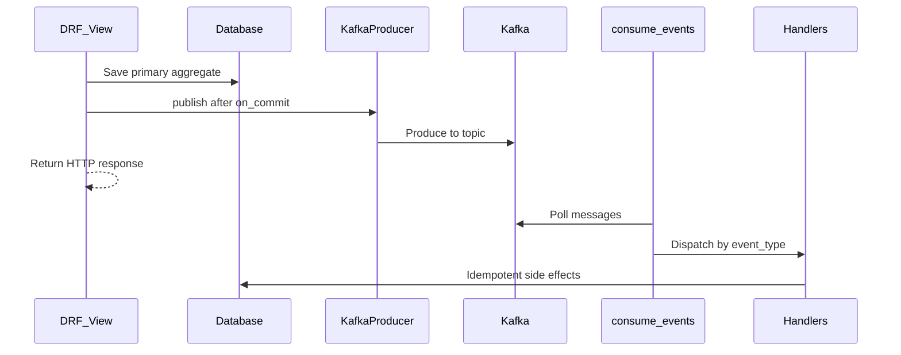

# Domain events (Kafka)

The CRM uses Kafka as the domain event bus. Views persist the primary aggregate, then publish an event after the DB transaction commits. A separate consumer process runs handlers.

## Flow



## Code layout

| Path | Purpose |
|------|---------|
| `events/types.py` | Event name constants and payload TypedDicts |
| `events/envelope.py` | Standard message envelope builder |
| `events/producer.py` | `publish(...)` via `confluent-kafka` |
| `events/consumer.py` | Poll loop |
| `events/handlers/` | Per-domain handlers + registry |
| `events/management/commands/consume_events.py` | `python manage.py consume_events` |
| `common/views.py` | `publish_after_commit(...)` helper |

## Envelope

```json
{
  "event_id": "uuid",
  "event_type": "LeadConverted",
  "occurred_at": "2026-08-29T06:00:00+00:00",
  "organization_id": 1,
  "payload": {}
}
```

Partition key is usually the entity id (or organization id) for per-entity ordering.

## Topics and events

Configured in `core.settings.KAFKA_TOPICS`:

| Event | Topic | Published from | Handler |
|-------|-------|----------------|---------|
| `LeadCalled` | `crm.lead.events` | `leads.LeadViewSet.mark_called` | Thin log |
| `LeadConverted` | `crm.lead.events` | `leads.LeadViewSet.convert_to_customer` | `get_or_create` Customer |
| `CustomerFollowedUp` | `crm.customer.events` | `customers.CustomerViewSet.follow_up` | Thin log |
| `WorkCreated` | `crm.work.events` | `works.WorkViewSet.perform_create` | Thin log |
| `WorkAssigned` | `crm.work.events` | `works.WorkViewSet.perform_update` | Thin log |
| `WorkStatusChanged` | `crm.work.events` | `works.WorkViewSet.perform_update` | Thin log |

### Create topics on a fresh broker

Redpanda may not have these topics until you create them. Before or right after starting `consume_events`:

```powershell
docker compose up -d
docker compose exec redpanda rpk topic create crm.lead.events crm.customer.events crm.work.events
docker compose exec redpanda rpk topic list
```

If the consumer logs `UNKNOWN_TOPIC_OR_PART` / `Subscribed topic not available`, the broker is up but the topics are missing — run the `rpk topic create` command above, then restart `consume_events` if needed.

## Publishing rules

- Always publish inside `transaction.on_commit` via `publish_after_commit`.
- Producer failures are logged; the primary DB write is not rolled back.
- Domain apps import `events.publish` / `EventNames` only (through `common.views` helpers where used).

## Consumer rules

- Manual offset commit after a successful handler.
- At-least-once delivery: handlers must be idempotent (`get_or_create` on unique org+email for customers).
- Poison messages are logged and skipped so the loop continues.
- The consumer can connect successfully and still error until topics exist (see above).

## Convert-to-customer contract

1. API sets `lead.status = converted` and returns **HTTP 202** with the lead payload.
2. Consumer handles `LeadConverted` and creates the customer.

Requirements for step 2:

- Redpanda running (`docker compose up -d`)
- Topics created (`rpk topic create ...`)
- `python manage.py consume_events` running

Frontend should refresh customers (or poll) after convert.

## Adding a new event

1. Add a constant (and payload type) in `events/types.py`.
2. Publish from the owning view with `publish_after_commit`.
3. Add a handler module entry and register it in `events/handlers/registry.py` (via that module’s `HANDLERS` dict).
4. Reuse an existing topic key or add one under `KAFKA_TOPICS`, and create the topic in Redpanda if it is new.
5. Add a unit test (handler and/or mocked producer).

## Local runbook

```powershell
docker compose up -d
docker compose exec redpanda rpk topic create crm.lead.events crm.customer.events crm.work.events
.\venv\Scripts\Activate.ps1
python manage.py runserver
# other terminal:
python manage.py consume_events
```

From **cmd**, prefer:

```cmd
powershell -ExecutionPolicy Bypass -File .\scripts\bootstrap.ps1
docker compose exec redpanda rpk topic create crm.lead.events crm.customer.events crm.work.events
.\venv\Scripts\activate.bat
python manage.py runserver
```

## Testing tips

- Patch `common.views.publish` (or `events.producer.get_producer`) so tests do not need a broker.
- Use `self.captureOnCommitCallbacks(execute=True)` when asserting publish-after-commit behavior under Django’s `TestCase`.
